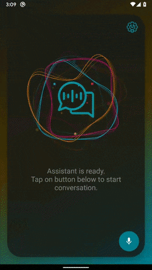

#  Aimybox Assistant
## Introduction
This application demonstrates the usage of Aimybox SDK and the integration of NLU engines like Aimybox, RASA and Dialogflow etc. UI is simple enough to use multiple NLU engines while keeping the core UI similar.

## Demo

## Play Store
This application is available on Play Store for demo purpose : [https://play.google.com/store/apps/details?id=com.sumit.assistant](https://play.google.com/store/apps/details?id=com.sumit.assistant)

## Aimybox Skills
By default the Aimybox NLU engine is trained with below skills

 1. Calculator
 2. Date & Time
 3. Geography Quiz
 4. Jokes
 5. Weather forecast by OpenWeatherMap
 6. Wikipedia

You can create your own Aimybox NLU engine and add skills from a preselected library : https://aimybox.com/. After creating, train the model then add the API key in app settings. Remember, app restart is needed for the changes to take effect. This is because the settings are applied in Application class level.

## RASA

Do read about RASA setup here : [https://blog.rasa.com/how-to-build-a-mobile-voice-assistant-with-open-source-rasa-and-aimybox/](https://blog.rasa.com/how-to-build-a-mobile-voice-assistant-with-open-source-rasa-and-aimybox/)

You can create your own RASA instance locally and expose the endpoint via ngrok : https://ngrok.com/ then add ngrok endpoint in the app settings.

## Implementation
This project is written in Kotlin and has below implementations

 1. Kotlin DSL based `build.gradle.kts` file : https://guides.gradle.org/migrating-build-logic-from-groovy-to-kotlin/
 2. Aimybox Android SDK : [https://github.com/just-ai/aimybox-android-assistant](https://github.com/just-ai/aimybox-android-assistant)
 3. DI by Koin : [https://insert-koin.io/](https://insert-koin.io/)
 4. Kotlin Android Extensions : https://developer.android.com/kotlin/ktx
 5. EncryptedSharedPreferences using Crypto Security library : [https://developer.android.com/reference/androidx/security/crypto/EncryptedSharedPreferences](https://developer.android.com/reference/androidx/security/crypto/EncryptedSharedPreferences)
 6. Gradient Animation using AnimationDrawable
 7. Lottie Animation : [https://github.com/airbnb/lottie-android](https://github.com/airbnb/lottie-android)
 8. Shared Element Transition : [https://developer.android.com/training/transitions/start-activity](https://developer.android.com/training/transitions/start-activity)

## 30 Days of Kotlin
This project has been submitted to `30 Days of Kotlin` initiative by Google : [https://eventsonair.withgoogle.com/events/kotlin](https://eventsonair.withgoogle.com/events/kotlin)

Thanks Google for showcasing this in Google Developers Webinar : https://youtu.be/WCxoDUcTsbU?t=3443

## Assets

Big thanks to below pages and authors for creating awesome contents that are free to use :) 

1. Lottie JSON file from : https://lottiefiles.com/
2. Icons from : https://www.flaticon.com/